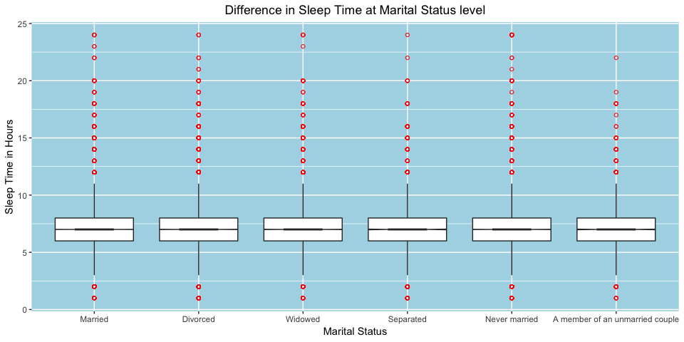

## Setup

### Load packages


```r
library(tidyverse)
```

### Load data


```r
load("brfss2013.RData")
```


* * *

## Part 1: Data

Data provided by course instructor. <br>
The Behavioral Risk Factor Surveillance System (BRFSS) is a collaborative project between all of the states in the United States (US) and participating US territories and the Centers for Disease Control and Prevention (CDC). The BRFSS goal is to collect uniform, state-specific data on preventive health practices and risk behaviors that are linked to chronic diseases, injuries, and preventable infectious diseases that affect the adult population. (from brfss codebook provided by instructor)

Participant were chosen by random. They were interviewed over phone.

* * *

## Part 2: Research questions

**Research quesion 1:**  

How sleep time vary in differnt group?  
In sex group, we will see is there any difference in sleep time between men and women.  
In the same way we will see is there any difference in sleep time in the following groups:  
Marital status, education, income, employment and internet users.  
  
varaible will be explored:  
sleptim1 - On average, How many hours of sleep do you get in a 24-hour period?  
sex - Respondents Sex  
marital - Marital Status  
educa - Education level  
income2 - Income level  
employ1 - Employment Status  
internet - Internet use in the past 30 days?  

**Research quesion 2:**  

How general health differ across different educational level?  
We will also see how number of the days physical health not good differ at educational level.  

Variable to be explored.  
educa - Education level.  
genhlth - General Health.    
physhlth - Number of days physical health not good.  


**Research quesion 3:**  

How stroke occureance differ in sex and income level?  
variable to be explored:  
cvdstrk3 - Ever diagnosed with a stroke  
sex - Respondents sex  
income2 - Income Level  


* * *

## Part 3: Exploratory data analysis

### Research Question 01

First we will create a dataframe(df) that contain all columns we will be working on.


```r
df <- select(brfss2013, 
             sleptim1,
             sex,
             marital,
             educa,
             income2,
             employ1,
             internet,
             genhlth,
             physhlth,
             cvdstrk3)
```


**Research quesion 1:** 

#### Sleep summary statistics {.tabset}  

##### sleep time vs sex  


```r
sleep_sex_summary <- select(df, sleptim1, sex) %>% 
    filter(sleptim1 <= 24 &
               sex != 'NA') %>% 
    group_by(sex) %>% 
    summarise(sleep_time_mean = mean(sleptim1), 
              sd = sd(sleptim1),
              median = median(sleptim1), 
              min = min(sleptim1), 
              max = max(sleptim1), 
              Q1 = quantile(sleptim1, probs = 0.25), 
              Q3 = quantile(sleptim1, probs = 0.75),
              IQR = IQR(sleptim1))

sleep_sex_summary
```

```
## # A tibble: 2 x 9
##   sex    sleep_time_mean    sd median   min   max    Q1    Q3   IQR
##   <fct>            <dbl> <dbl>  <dbl> <dbl> <dbl> <dbl> <dbl> <dbl>
## 1 Male              7.03  1.45      7     1    24     6     8     2
## 2 Female            7.06  1.48      7     1    24     6     8     2
```

##### sleep time vs marital status  


```r
sleep_marital_summary <- select(df, sleptim1, marital) %>% 
    filter(sleptim1 <= 24 &
               marital != 'NA') %>% 
    group_by(marital) %>% 
    summarise(sleep_time_mean = mean(sleptim1), 
              sd = sd(sleptim1),
              median = median(sleptim1), 
              min = min(sleptim1), 
              max = max(sleptim1), 
              Q1 = quantile(sleptim1, probs = 0.25), 
              Q3 = quantile(sleptim1, probs = 0.75),
              IQR = IQR(sleptim1))

sleep_marital_summary
```

```
## # A tibble: 6 x 9
##   marital       sleep_time_mean    sd median   min   max    Q1    Q3   IQR
##   <fct>                   <dbl> <dbl>  <dbl> <dbl> <dbl> <dbl> <dbl> <dbl>
## 1 Married                  7.08  1.31      7     1    24     6     8     2
## 2 Divorced                 6.91  1.62      7     1    24     6     8     2
## 3 Widowed                  7.22  1.61      7     1    24     6     8     2
## 4 Separated                6.69  1.84      7     1    24     6     8     2
## 5 Never married            7.00  1.58      7     1    24     6     8     2
## 6 A member of …            6.96  1.47      7     1    22     6     8     2
```


##### sleep time vs education level  


```r
options(width = 100)

sleep_education_summary <- select(df, sleptim1, educa) %>% 
    filter(sleptim1 <= 24 &
               educa != 'NA') %>% 
    group_by(educa) %>% 
    summarise(sleep_time_mean = mean(sleptim1), 
              sd = sd(sleptim1),
              median = median(sleptim1), 
              min = min(sleptim1), 
              max = max(sleptim1), 
              Q1 = quantile(sleptim1, probs = 0.25), 
              Q3 = quantile(sleptim1, probs = 0.75),
              IQR = IQR(sleptim1)) %>% 
    print()
```

```
## # A tibble: 6 x 9
##   educa                                  sleep_time_mean    sd median   min   max    Q1    Q3   IQR
##   <fct>                                            <dbl> <dbl>  <dbl> <dbl> <dbl> <dbl> <dbl> <dbl>
## 1 Never attended school or only kinderg…            7.02  2.31      7     1    24     6     8     2
## 2 Grades 1 through 8 (Elementary)                   7.09  1.95      7     1    24     6     8     2
## 3 Grades 9 though 11 (Some high school)             6.99  1.95      7     1    24     6     8     2
## 4 Grade 12 or GED (High school graduate)            7.05  1.60      7     1    24     6     8     2
## 5 College 1 year to 3 years (Some colle…            6.99  1.45      7     1    24     6     8     2
## 6 College 4 years or more (College grad…            7.10  1.20      7     1    24     6     8     2
```


##### Sleep time vs Income level  


```r
options(width = 100)
sleep_income_summary <- select(df, sleptim1, income2) %>% 
    filter(sleptim1 <= 24 &
               income2 != 'NA') %>% 
    group_by(income2) %>% 
    summarise(sleep_time_mean = mean(sleptim1), 
              sd = sd(sleptim1),
              median = median(sleptim1), 
              min = min(sleptim1), 
              max = max(sleptim1), 
              Q1 = quantile(sleptim1, probs = 0.25), 
              Q3 = quantile(sleptim1, probs = 0.75),
              IQR = IQR(sleptim1))

sleep_income_summary
```

```
## # A tibble: 8 x 9
##   income2           sleep_time_mean    sd median   min   max    Q1    Q3   IQR
##   <fct>                       <dbl> <dbl>  <dbl> <dbl> <dbl> <dbl> <dbl> <dbl>
## 1 Less than $10,000            6.86  2.06      7     1    24     6     8     2
## 2 Less than $15,000            6.95  1.90      7     0    22     6     8     2
## 3 Less than $20,000            7.03  1.77      7     1    24     6     8     2
## 4 Less than $25,000            7.04  1.62      7     1    24     6     8     2
## 5 Less than $35,000            7.07  1.47      7     1    24     6     8     2
## 6 Less than $50,000            7.07  1.35      7     1    24     6     8     2
## 7 Less than $75,000            7.05  1.23      7     1    24     6     8     2
## 8 $75,000 or more              7.05  1.12      7     1    24     6     8     2
```


##### Sleep time vs Employment status  


```r
sleep_employment_summary <- select(df, sleptim1, employ1) %>% 
    filter(sleptim1 <= 24 &
               employ1 != 'NA') %>% 
    group_by(employ1) %>% 
    summarise(sleep_time_mean = mean(sleptim1), 
              sd = sd(sleptim1),
              median = median(sleptim1), 
              min = min(sleptim1), 
              max = max(sleptim1), 
              Q1 = quantile(sleptim1, probs = 0.25), 
              Q3 = quantile(sleptim1, probs = 0.75),
              IQR = IQR(sleptim1))

sleep_employment_summary
```

```
## # A tibble: 8 x 9
##   employ1                          sleep_time_mean    sd median   min   max    Q1    Q3   IQR
##   <fct>                                      <dbl> <dbl>  <dbl> <dbl> <dbl> <dbl> <dbl> <dbl>
## 1 Employed for wages                          6.89  1.21      7     1    24     6     8     2
## 2 Self-employed                               7.08  1.26      7     1    22     6     8     2
## 3 Out of work for 1 year or more              6.91  1.85      7     1    24     6     8     2
## 4 Out of work for less than 1 year            6.98  1.67      7     0    24     6     8     2
## 5 A homemaker                                 7.19  1.46      7     1    24     6     8     2
## 6 A student                                   7.07  1.38      7     1    24     6     8     2
## 7 Retired                                     7.35  1.47      7     1    24     6     8     2
## 8 Unable to work                              6.75  2.31      6     1    24     5     8     3
```


##### Sleep time vs Internet user  


```r
sleep_internet_summary <- select(df, sleptim1, internet) %>% 
    filter(sleptim1 <= 24 &
               internet!= 'NA') %>% 
    group_by(internet) %>% 
    summarise(sleep_time_mean = mean(sleptim1), 
              sd = sd(sleptim1),
              median = median(sleptim1), 
              min = min(sleptim1), 
              max = max(sleptim1), 
              Q1 = quantile(sleptim1, probs = 0.25), 
              Q3 = quantile(sleptim1, probs = 0.75),
              IQR = IQR(sleptim1))

sleep_internet_summary
```

```
## # A tibble: 2 x 9
##   internet sleep_time_mean    sd median   min   max    Q1    Q3   IQR
##   <fct>              <dbl> <dbl>  <dbl> <dbl> <dbl> <dbl> <dbl> <dbl>
## 1 Yes                 7.01  1.33      7     1    24     6     8     2
## 2 No                  7.18  1.82      7     1    24     6     8     2
```


#### sleep time plot {.tabset}


##### sleep time vs sex 
In this plot we will see whether sleep time vary in male and female.  


```r
sleep_sex_plot <- select(df, sleptim1, sex) %>% 
    filter(sleptim1 <= 24 &
               sex != 'NA') %>% 
    ggplot(mapping = aes(x = sex, y = sleptim1))+
    geom_boxplot(outlier.colour = 'red',
                 outlier.shape = 1,
                 notch = F,
                 width = 0.5)+
    xlab('Sex')+
    ylab('Sleep Time in Hours')+
    ggtitle('Difference in Sleep Time in Sex group' )+
    theme(panel.background = element_rect(fill = 'light blue'))+
    theme(plot.title = element_text(hjust = 0.5))
   
    
sleep_sex_plot
```

<!-- -->

From the plot we can see that median sleeping time between male and female does not differ.  


##### sleep time vs marital status  


```r
sleep_marital_plot <- select(df, sleptim1, marital) %>% 
    filter(sleptim1 <= 24 &
               marital != 'NA') %>% 
    ggplot(mapping = aes(x = marital, y = sleptim1))+
    geom_boxplot(outlier.colour = 'red',
                 outlier.shape = 1,
                 notch = T)+
    xlab('Marital Status')+
    ylab('Sleep Time in Hours')+
    ggtitle('Difference in Sleep Time at Marital Status level' )+
    theme(panel.background = element_rect(fill = 'light blue'))+
    theme(plot.title = element_text(hjust = 0.5))+
    theme(axis.text.x = element_text(angle = 0))
sleep_marital_plot
```

<!-- -->

Does not differ among different groups.

##### sleep time vs education level  


```r
sleep_education_plot <- select(df, sleptim1, educa) %>% 
    filter(sleptim1 <= 24 &
               educa != 'NA') %>% 
    ggplot(mapping = aes(x = educa, y = sleptim1))+
    geom_boxplot(outlier.colour = 'red',
                 outlier.shape = 1,
                 notch = T)+
    coord_flip()+
    xlab('Education Level')+
    ylab('Sleep Time in Hours')+
    ggtitle('Difference in Sleep Time at Education level' )+
    theme(panel.background = element_rect(fill = 'light blue'))+
    theme(plot.title = element_text(hjust = 0.5))
sleep_education_plot
```

<!-- -->

 Also does not differ among different groups.

##### Sleep time vs Income level  


```r
sleep_income_plot <- select(df, sleptim1, income2) %>% 
    filter(sleptim1 <= 24 &
               income2 != 'NA') %>% 
    ggplot(mapping = aes(x = income2, y = sleptim1))+
    geom_boxplot(outlier.colour = 'red',
                 outlier.shape = 1,
                 notch = T)+
    xlab('Income Level')+
    ylab('Sleep Time in Hours')+
    ggtitle('Difference in Sleep Time at Income level' )+
    theme(panel.background = element_rect(fill = 'light blue'))+
    theme(plot.title = element_text(hjust = 0.5))
sleep_income_plot
```

<!-- -->


Does not differ among different groups.


##### Sleep time vs Employment status  


```r
sleep_employment_plot <- select(df, sleptim1, employ1) %>% 
    filter(sleptim1 <= 24 &
               employ1 != 'NA') %>% 
    ggplot(mapping = aes(x = employ1, y = sleptim1))+
    geom_boxplot(outlier.colour = 'red',
                 outlier.shape = 1,
                 notch = T)+
    coord_flip()+
    xlab('Employment Status')+
    ylab('Sleep Time in Hours')+
    ggtitle('Difference in Sleep Time at Employment Status' )+
    theme(panel.background = element_rect(fill = 'light blue'))+
    theme(plot.title = element_text(hjust = 0.5))
sleep_employment_plot
```

<!-- -->

One thing to notice here those unable to work sleep less than any other employment groups.


##### Sleep time vs Internet user  


```r
sleep_internet_plot <- select(df, sleptim1, internet) %>% 
    filter(sleptim1 <= 24 &
               internet != 'NA') %>% 
    ggplot(mapping = aes(x = internet, y = sleptim1))+
    geom_boxplot(outlier.colour = 'red',
                 outlier.shape = 1,
                 notch = T,
                 width = 0.5)+
    xlab('Internet User')+
    ylab('Sleep Time in Hours')+
    ggtitle('Difference in Sleep Time of Internet Users' )+
    theme(panel.background = element_rect(fill = 'light blue'))+
    theme(plot.title = element_text(hjust = 0.5))
sleep_internet_plot
```

<!-- -->

Does not differ between groups.

### Research Question 02   

#### Overall General Health at Education level  


```r
Ghealth_education <- select(df, genhlth, educa) %>% 
    filter(genhlth != 'NA' &
               educa != 'NA') %>% 
    ggplot()+
    geom_bar(aes(educa, fill = genhlth), position = position_fill())+
    xlab("Education")+
    ylab("Overall Health in General")+
    labs(fill = 'Overall Health in General')+
    ggtitle('Overall health condition at education level')+
    theme(panel.background = element_rect(fill = 'light blue'))+
    
    theme(plot.title = element_text(hjust = 0.5,size = 20))+ # for title
    theme(axis.title.y = element_text(size =18))+ # for ylab
    theme(axis.title.x = element_text(size =18))+
    
    scale_x_discrete(labels = c('Never attended school or only kindergarten'= 'Kindergarten',
                                'Grades 1 through 8 (Elementary)'= 'Elementary',
                                'Grades 9 though 11 (Some high school)' = 'Some high school',
                                'Grade 12 or GED (High school graduate)' = 'High school graduate', 
                                'College 1 year to 3 years (Some college or technical school)'= 'Some college',
                                'College 4 years or more (College graduate)'= 'College graduate'))+  # change label old=new
    theme(axis.text.x = element_text(size= 14, angle = 45, hjust = 1)) # axis text

    
Ghealth_education
```


form above plot, overall health condition is much better in some college and college graduate group than other groups.

#### Number of days physical health not good at Education Level


```r
phys_health_education <- select(df, physhlth, educa) %>% 
    filter(educa != 'NA' &
               physhlth != 'NA' & physhlth <= 30)
```


```r
summary(phys_health_education$physhlth)
```

```
##    Min. 1st Qu.  Median    Mean 3rd Qu.    Max. 
##   0.000   0.000   0.000   4.353   3.000  30.000
```
Since median is zero 
Here,  Number of days physical health not good zero means physical health was good for all 30 days. 

lets remove those were 30 days in good health and compare those were at least not good one day. 


```r
phys_health_education <- select(df, physhlth, educa) %>% 
    filter(educa != 'NA' &
               physhlth != 'NA' & physhlth <= 30 & physhlth != 0) %>% 
    ggplot()+
    geom_boxplot(aes( x = educa, y = physhlth),
                 outlier.colour = 'red',
                 outlier.shape = 1,
                 width = 0.5)+
    xlab('Education')+
    ylab('Number of days physical health not good')+
    labs(fill = 'Physical Health')+
    ggtitle('Number of the day physical health not good at education level')+
    theme(panel.background = element_rect(fill = 'light blue'))+
    theme(plot.title = element_text(hjust = 0.5))+
    coord_flip()
    

phys_health_education
```

<!-- -->

Number of the day physical health was not good is less in who have college education than who don't have.

### Research quesion 03  {.tabset}

#### Stroke prevalence in sex level


```r
stroke_sex <- select(df, cvdstrk3, sex) %>% 
    filter(cvdstrk3 != 'NA' &
               sex != 'NA') %>% 
    ggplot()+
    geom_bar(aes(sex, fill = cvdstrk3), position = position_fill())+
    xlab('Sex')+
    ylab('Proportion')+
    labs(fill = 'Stroke')+
    ggtitle('Stroke Prevalance in Sex')+
    theme(plot.title = element_text(hjust = 0.5))+
    theme(panel.background = element_rect(fill = 'light blue'))
    

stroke_sex
```

<!-- -->

No difference of stroke prevalence in male and female.

#### stroke prevalance in income level  


```r
stroke_income <- select(df, cvdstrk3, income2) %>% 
    filter(cvdstrk3 != 'NA' &
               income2 != 'NA') %>% 
    ggplot()+
    geom_bar(aes(income2, fill= cvdstrk3), position = position_fill())+
    coord_flip()+
    xlab('Income')+
    ylab('Proprotion')+
    labs(fill = "Stroke")+
    ggtitle('Stroke Prevalance at Income level')+
    theme(panel.background = element_rect(fill = 'light blue'))+
    theme(plot.title = element_text(hjust = 0.5))
    
    

stroke_income
```

<!-- -->

Higher income people have less stroke prevalence compare to low income level.
