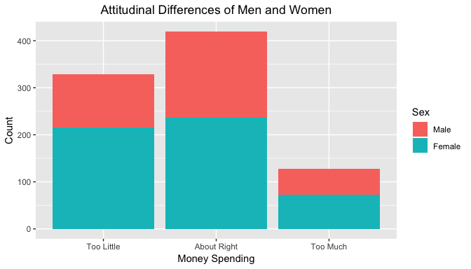

### Load packages


```r
library(tidyverse)
library(statsr)
```

### Load data


```r
load("gss.Rdata")
```


* * *

## Part 1: Data

Random saple were used in this survey. Resutls can be generalized to US population. No random assignment was used so causality cannot be inferred.

* * *

## Part 2: Research Question

There is a general idea that women are more compassionate than men.  So there is a chance that attitude to some social problem would be different between men and women.  
Now, I want to see is there any difference in attitude of men and women toward the spending of the money for improving conditions of the blacks. 

variable to be explored-  

* sex - respondent's sex  
* natrace - attitude toward spending money for improving the conditions of blacks.  

I will use data from 2012 for my ressearch question.

* * *

## Part 3: Exploratory data analysis

I will build the contingency table for my two categorical variable sex and natrace.  
Before that I will build a dataframe with the variable of interest. 


```r
# using select command from dplyr to build a dataframe with selected columns.
gss <- select(gss,sex, natrace, year)
```

Since I am only interested in 2012 data so I will filter the data using filter command from dplyr and I will also drop all missing values(NA).


```r
gss <- gss %>% 
    filter(year ==  2012) %>% 
    drop_na()
```

Lets check the structure of the data


```r
# structure of the data
str(gss)
```

```
## 'data.frame':	877 obs. of  3 variables:
##  $ sex    : Factor w/ 2 levels "Male","Female": 1 2 2 2 2 2 2 2 2 2 ...
##  $ natrace: Factor w/ 3 levels "Too Little","About Right",..: 2 3 2 1 1 1 1 1 2 1 ...
##  $ year   : int  2012 2012 2012 2012 2012 2012 2012 2012 2012 2012 ...
```


```r
# dimension of data

dim(gss)
```

```
## [1] 877   3
```


```r
# head of data

head(gss)
```

<div class="kable-table">

     sex      natrace        year
---  -------  ------------  -----
3    Male     About Right    2012
6    Female   Too Much       2012
7    Female   About Right    2012
9    Female   Too Little     2012
10   Female   Too Little     2012
12   Female   Too Little     2012

</div>


```r
# quick summary
summary(gss)
```

```
##      sex             natrace         year     
##  Male  :353   Too Little :329   Min.   :2012  
##  Female:524   About Right:420   1st Qu.:2012  
##               Too Much   :128   Median :2012  
##                                 Mean   :2012  
##                                 3rd Qu.:2012  
##                                 Max.   :2012
```


Now build the contingency table to summarise my data.  


```r
# I can use table function like this 
gss_tab <- table(gss$sex, gss$natrace)
gss_tab
```

```
##         
##          Too Little About Right Too Much
##   Male          113         184       56
##   Female        216         236       72
```

OR


```r
# I can use xtabs function like this
gss_xtab <- xtabs(~sex + natrace, gss)
gss_xtab
```

```
##         natrace
## sex      Too Little About Right Too Much
##   Male          113         184       56
##   Female        216         236       72
```

```r
# I will use gss_xtab table for further analysis
```

I can add column sum and row sum to my table if I want,    
using addmargins command.  


```r
addmargins(gss_xtab)
```

```
##         natrace
## sex      Too Little About Right Too Much Sum
##   Male          113         184       56 353
##   Female        216         236       72 524
##   Sum           329         420      128 877
```

Now lets convert to proportion table.   


```r
#proportion to row sum and will round the value to 3 digits
round(prop.table(gss_xtab, margin = 1), 3)
```

```
##         natrace
## sex      Too Little About Right Too Much
##   Male        0.320       0.521    0.159
##   Female      0.412       0.450    0.137
```

I want to see as percentage so I have to multiply by 100 here.  


```r
# as percentage
100 * (round(prop.table(gss_xtab, margin = 1), 3))
```

```
##         natrace
## sex      Too Little About Right Too Much
##   Male         32.0        52.1     15.9
##   Female       41.2        45.0     13.7
```

From the above table, 32% male  think that too little money is spending for improving
conditions of blacks where 42% female think as same.   Also there are diffence in male and female percentage who think spending is about right or too much.

Now plot the data to visualize.  


```r
ggplot(data = gss, aes(x= natrace, fill=sex))+
    geom_bar()+
    xlab('Money Spending')+
    ylab('Count')+
    labs(fill = 'Sex')+
    ggtitle('Attitudinal Differences of Men and Women')+
    theme(plot.title = element_text(hjust = 0.5))
```



From the above bar plot,    
there are difference in male and female proportion in each sub categoty of spending money.


* * *

## Part 4: Inference

### Hypothesis

Null Hypotheis:  

Sex and attitude toward spending for improving conditions of blacks are independent.

Alternative Hypothesis:  

Sex and attitude toward spending for improving conditions of blacks are dependent.

### Conditions

I am using two categorical varible with two or more levels, so we will use chi-square test as statistical method. Now check whether our data met other conditions for chi-square test.

* Random sample -- our sample are random
* if sampling without replacement, n< 10 % of population -- sample is less than 10% of population, n is 877.
* each case only contributes to one cell ine the table -- each case only contributed once.
* sample size: each particular scenario must have at least 5 expected case -- each cell have more than 5 cases.


### Statistical Method

As I mentioned before since I am using two categorical variable with two or more levels I am going to use chi-square test as my statistical method to see wheter there is association between sex and attitude toward spending money for blacks.


### Code and output


```r
# I have used gss_xtab table that I have built earlier

chisq.test(gss_xtab)
```

```
## 
## 	Pearson's Chi-squared test
## 
## data:  gss_xtab
## X-squared = 7.6324, df = 2, p-value = 0.02201
```


### Interpretations

From the output, the p value is 0.02201.  
Since p value is less than 0.05, we reject the null hypothesis.   
So, Conclusion is that Sex and attitude toward spending for improving conditions of blacks are dependent.


### Reason for why Cl in not included


Confidence Interval is not included because both Variable are categorical with two or more variables and chi-square test has been used.
