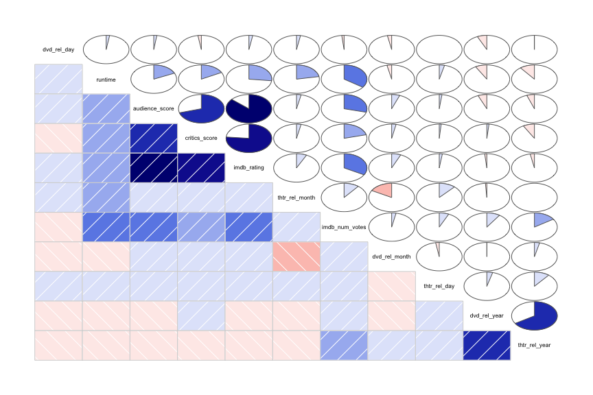
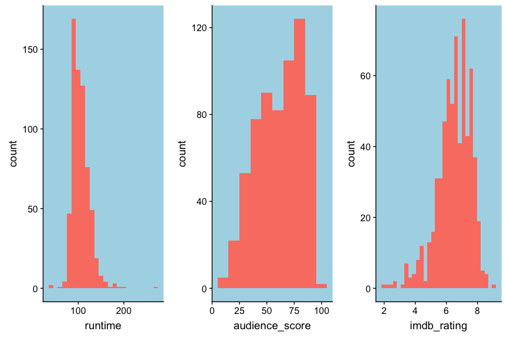
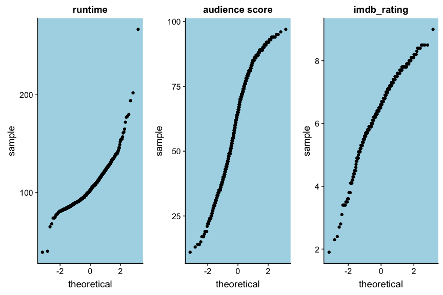
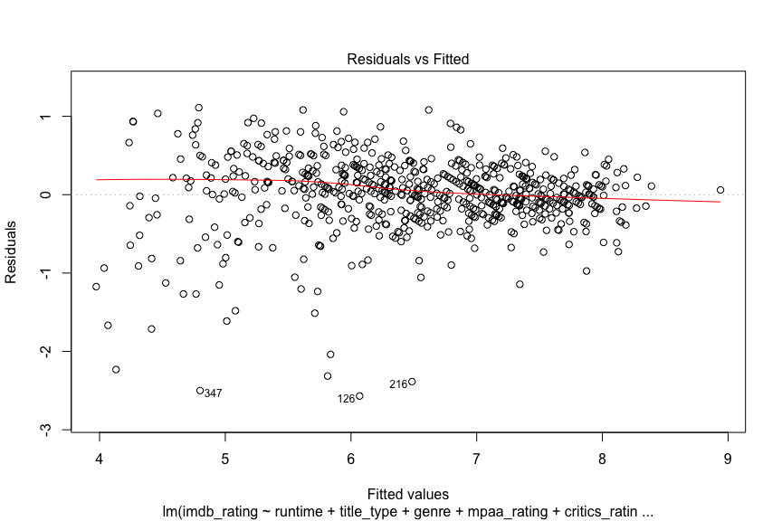
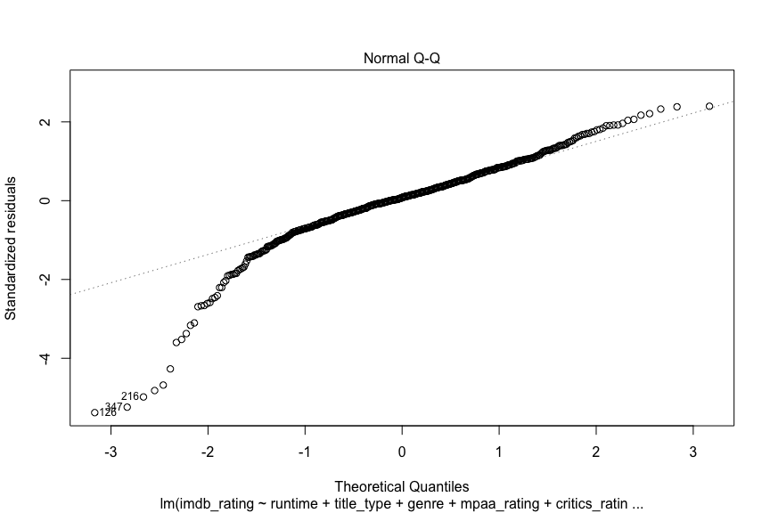
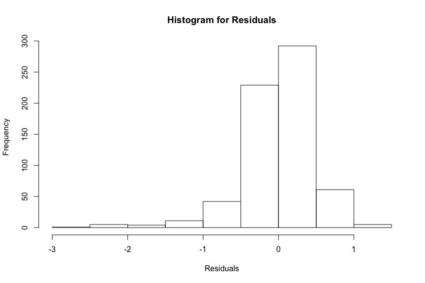
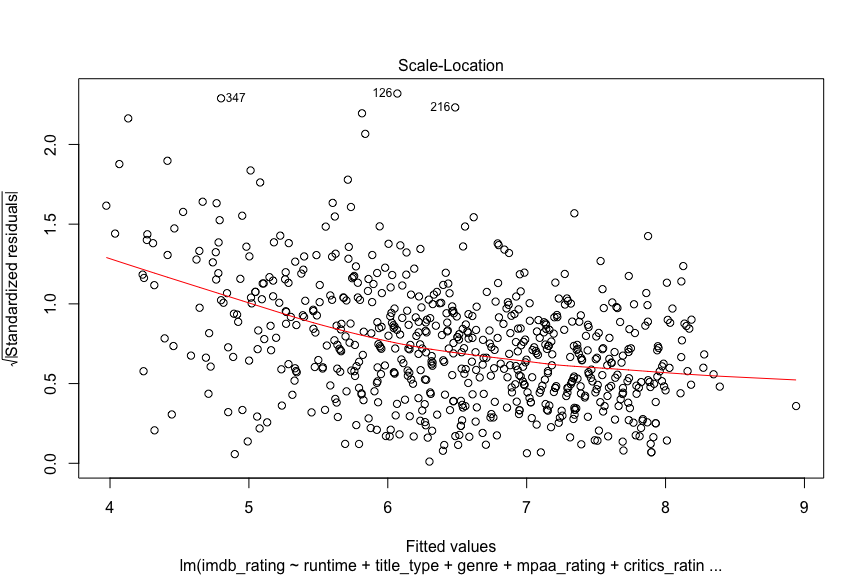
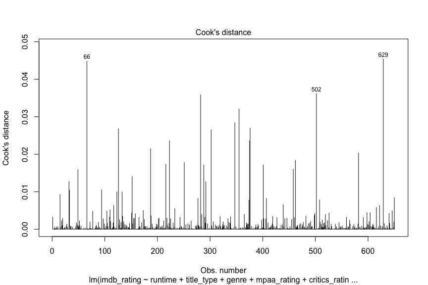

## Setup

### Load packages


```r
library(tidyverse)
library(statsr)
library(corrgram)
```

### Load data


```r
load("movies.Rdata")
```

* * *

## Part 1: Data

Data provided by instructor.

* * *

## Part 2: Research question

Every year a lot of new movies get released. So it is very difficult to choose which movie should watch.  
Imdb rating is one way to tell that I should watch the movie or not. Now It would be very interesting If I could build a model that can predict imdb rating. So the question is:    
Can imdb_rating be predicted from    
* runtime   
* title_type   
* genre  
* mpaa_rating  
* critics_rating  
* audience_rating  
* audience_score    
* best_pic_nom  
* best_pic_win   
* top200_box

* * *

## Part 3: Exploratory data analysis  

### Correlation Matrix  

I am going to start with a correlation matrix of numerical variables.  


```r
# configure output

# corrgram libraby is used here  

corrgram(movies, order = TRUE, 
         lower.panel = panel.shade, 
         upper.panel = panel.pie, 
         text.panel = panel.txt)
```

<!-- -->
  

From the correlation matrix I can see that ibdb_rating is highly correlated with critics score and audience score. Also imdb rating correlated with runtime and imdb number of votes.  

### Subset the movies data set     


I will build a dataframe with column of my interests. The reason for choosing certain variable explained in modeling part.
I will my dataframe movies_1. There are few way handing missing data but I will drop NA value from my data set for now. 


```r
movies_1 <- select( movies,
                 imdb_rating,
                 runtime,
                 title_type,
                 genre,
                 mpaa_rating,
                 critics_rating,
                 audience_rating,
                 audience_score,
                 best_pic_nom,
                 best_pic_win,
                 top200_box)
```


```r
movies_1 <- movies_1 %>% drop_na()
```
  

lets check the structure of the dataset with str() function.  
there are few numeric column and rest are factor column.  


  

```r
str(movies_1)
```

```
## Classes 'tbl_df', 'tbl' and 'data.frame':	650 obs. of  11 variables:
##  $ imdb_rating    : num  5.5 7.3 7.6 7.2 5.1 7.8 7.2 5.5 7.5 6.6 ...
##  $ runtime        : num  80 101 84 139 90 78 142 93 88 119 ...
##  $ title_type     : Factor w/ 3 levels "Documentary",..: 2 2 2 2 2 1 2 2 1 2 ...
##  $ genre          : Factor w/ 11 levels "Action & Adventure",..: 6 6 4 6 7 5 6 6 5 6 ...
##  $ mpaa_rating    : Factor w/ 6 levels "G","NC-17","PG",..: 5 4 5 3 5 6 4 5 6 6 ...
##  $ critics_rating : Factor w/ 3 levels "Certified Fresh",..: 3 1 1 1 3 2 3 3 2 1 ...
##  $ audience_rating: Factor w/ 2 levels "Spilled","Upright": 2 2 2 2 1 2 2 1 2 2 ...
##  $ audience_score : num  73 81 91 76 27 86 76 47 89 66 ...
##  $ best_pic_nom   : Factor w/ 2 levels "no","yes": 1 1 1 1 1 1 1 1 1 1 ...
##  $ best_pic_win   : Factor w/ 2 levels "no","yes": 1 1 1 1 1 1 1 1 1 1 ...
##  $ top200_box     : Factor w/ 2 levels "no","yes": 1 1 1 1 1 1 1 1 1 1 ...
```
  

I can see summary of my data set using summary() function.  Summary function come back with minimum, maximum, mean, median, 1st quartile and 3rd quartile value. For the factor variable it come back with number of case of each level. There is no missing values in the dataset. 


  


```r
summary(movies_1)
```

```
##   imdb_rating       runtime             title_type 
##  Min.   :1.900   Min.   : 39.0   Documentary : 54  
##  1st Qu.:5.900   1st Qu.: 92.0   Feature Film:591  
##  Median :6.600   Median :103.0   TV Movie    :  5  
##  Mean   :6.492   Mean   :105.8                     
##  3rd Qu.:7.300   3rd Qu.:115.8                     
##  Max.   :9.000   Max.   :267.0                     
##                                                    
##                 genre      mpaa_rating          critics_rating
##  Drama             :305   G      : 19   Certified Fresh:135   
##  Comedy            : 87   NC-17  :  2   Fresh          :208   
##  Action & Adventure: 65   PG     :118   Rotten         :307   
##  Mystery & Suspense: 59   PG-13  :133                         
##  Documentary       : 51   R      :329                         
##  Horror            : 23   Unrated: 49                         
##  (Other)           : 60                                       
##  audience_rating audience_score  best_pic_nom best_pic_win top200_box
##  Spilled:275     Min.   :11.00   no :628      no :643      no :635   
##  Upright:375     1st Qu.:46.00   yes: 22      yes:  7      yes: 15   
##                  Median :65.00                                       
##                  Mean   :62.35                                       
##                  3rd Qu.:80.00                                       
##                  Max.   :97.00                                       
## 
```


### Now visualise our data.  

#### Boxplot  


```r
# I will use plot_grid function from cowplot here.

library(cowplot)

q1 <- ggplot(movies_1, aes(x ='', y = runtime))+
    geom_boxplot()+
     theme(panel.background = element_rect(fill = 'light blue'))


q2 <- ggplot(movies_1, aes(x ='', y = audience_score))+
    geom_boxplot()+
     theme(panel.background = element_rect(fill = 'light blue'))

q3 <- ggplot(movies_1, aes(x ='', y = imdb_rating))+
    geom_boxplot()+
     theme(panel.background = element_rect(fill = 'light blue'))

plot_grid(q1,q2,q3, ncol = 3, nrow = 1)
```


From the above boxplot I can see there are outliers in runtime and imdb rating. Right now, I am not worried about outliers. I will check later on whether these outlier are influential or not.

#### HISTOGRAM


```r
h1 <- ggplot(movies_1, aes(runtime))+
    geom_histogram(binwidth = 10, fill = 'salmon')+
    theme(panel.background = element_rect(fill = 'light blue'))

h2 <- ggplot(movies_1, aes(audience_score))+
    geom_histogram(binwidth = 10, fill = 'salmon')+
    theme(panel.background = element_rect(fill = 'light blue'))

h3 <- ggplot(movies_1, aes(imdb_rating))+
    geom_histogram(fill = 'salmon')+
    theme(panel.background = element_rect(fill = 'light blue'))
plot_grid(h1,h2,h3, ncol = 3, nrow = 1)
```

<!-- -->


 From above plot, Except some outliers all numeric varible seems normally distributed.


#### QQ-PLOT


```r
qq1 <- ggplot(movies_1, aes(sample = runtime) )+
    stat_qq()+
    theme(panel.background = element_rect(fill = 'light blue'))+
    ggtitle('runtime')
qq2 <- ggplot(movies_1, aes(sample = audience_score) )+
    stat_qq()+ 
    theme(panel.background = element_rect(fill = 'light blue'))+
    ggtitle('audience score')
qq3 <- ggplot(movies_1, aes(sample = imdb_rating) )+
    stat_qq()+theme(panel.background = element_rect(fill = 'light blue'))+
    ggtitle('imdb_rating')
plot_grid(qq1,qq2,qq3, ncol = 3, nrow = 1)
```

<!-- -->

The qq plot is not stright because there are outliers, otherwise it seems fairly linear.

* * * 

## Part 4: Modeling

### Specify which variables to consider for the full model

* **imdb_rating** - Rating on IMDB  
* **runtime** - Runtime of movie (in minutes)     
* **title_type** - Type of movie (Documentary, Feature Film, TV Movie)    
* **genre** - Genre of movie (Action & Adventure, Comedy, Documentary, Drama, Horror, Mystery & Suspense, Other)   
* **mpaa_rating** - MPAA rating of the movie (G, PG, PG-13, R, Unrated)  
* **critics_rating** - Categorical variable for critics rating on Rotten Tomatoes (Certified Fresh, Fresh, Rotten)  
* **audience_rating** - Categorical variable for audience rating on Rotten Tomatoes (Spilled, Upright)  
* **audience_score** - Audience score on Rotten Tomatoes     
* **best_pic_nom** - Whether or not the movie was nominated for a best picture Oscar (no, yes)  
* **best_pic_win** - Whether or not the movie won a best picture Oscar (no, yes)   
* **top200_box** - Whether or not the movie is in the Top 200 Box Office list on BoxOfficeMojo (no, yes)  

### Reasoning for excluding certain variables

Factor variable studio excluded because it has 211 level. all charcter variable excluded beacause it is not appropriate for regression model. critic score is excluded since it highly correlated with audience score and I have already added audience score in my model. imdb number of vote also excluded for same reason. otherwise, either theater release year or dvd release year is not much related to imdb rating so all year day month variable are excluded. 

### Reasoning for choice of model selection method 

Since adjusted $R^2$ is more reliable than p value selection so  I will use backward elimination using adjusted $R^2$ value.


### Carrying out the model selection correctly  


```r
model_full <- lm(imdb_rating ~
                 runtime+
                 title_type+
                 genre+
                 mpaa_rating+
                 critics_rating+
                 audience_rating+
                 audience_score+
                 best_pic_nom+
                 best_pic_win+
                 top200_box, data = movies_1) 
```
          
Here is the summary and anova table for model.


```r
summary(model_full)
```

```
## 
## Call:
## lm(formula = imdb_rating ~ runtime + title_type + genre + mpaa_rating + 
##     critics_rating + audience_rating + audience_score + best_pic_nom + 
##     best_pic_win + top200_box, data = movies_1)
## 
## Residuals:
##      Min       1Q   Median       3Q      Max 
## -2.56893 -0.19197  0.03524  0.25793  1.11120 
## 
## Coefficients:
##                                 Estimate Std. Error t value Pr(>|t|)    
## (Intercept)                     3.651036   0.267944  13.626  < 2e-16 ***
## runtime                         0.005719   0.001114   5.135 3.77e-07 ***
## title_typeFeature Film         -0.247236   0.180088  -1.373 0.170287    
## title_typeTV Movie             -0.405054   0.283519  -1.429 0.153601    
## genreAnimation                 -0.417820   0.190199  -2.197 0.028405 *  
## genreArt House & International  0.241813   0.146782   1.647 0.099973 .  
## genreComedy                    -0.136525   0.080911  -1.687 0.092037 .  
## genreDocumentary                0.180958   0.193645   0.934 0.350416    
## genreDrama                      0.131726   0.070156   1.878 0.060898 .  
## genreHorror                     0.123050   0.121207   1.015 0.310399    
## genreMusical & Performing Arts  0.024397   0.166037   0.147 0.883229    
## genreMystery & Suspense         0.300666   0.090370   3.327 0.000929 ***
## genreOther                      0.037498   0.138287   0.271 0.786360    
## genreScience Fiction & Fantasy -0.183601   0.172985  -1.061 0.288932    
## mpaa_ratingNC-17               -0.167508   0.367491  -0.456 0.648681    
## mpaa_ratingPG                  -0.184847   0.133803  -1.381 0.167623    
## mpaa_ratingPG-13               -0.182783   0.137780  -1.327 0.185116    
## mpaa_ratingR                   -0.121028   0.133321  -0.908 0.364335    
## mpaa_ratingUnrated             -0.188623   0.153116  -1.232 0.218454    
## critics_ratingFresh            -0.092189   0.057115  -1.614 0.107012    
## critics_ratingRotten           -0.354180   0.063595  -5.569 3.80e-08 ***
## audience_ratingUpright         -0.432681   0.077420  -5.589 3.42e-08 ***
## audience_score                  0.047599   0.002081  22.876  < 2e-16 ***
## best_pic_nomyes                -0.023536   0.125670  -0.187 0.851501    
## best_pic_winyes                 0.123255   0.211790   0.582 0.560800    
## top200_boxyes                   0.032252   0.132990   0.243 0.808462    
## ---
## Signif. codes:  0 '***' 0.001 '**' 0.01 '*' 0.05 '.' 0.1 ' ' 1
## 
## Residual standard error: 0.4836 on 624 degrees of freedom
## Multiple R-squared:  0.809,	Adjusted R-squared:  0.8013 
## F-statistic: 105.7 on 25 and 624 DF,  p-value: < 2.2e-16
```


```r
anova(model_full)
```

<div class="kable-table">

                    Df        Sum Sq       Mean Sq       F value      Pr(>F)
----------------  ----  ------------  ------------  ------------  ----------
runtime              1    54.9593548    54.9593548   235.0439460   0.0000000
title_type           2   101.7089717    50.8544859   217.4887073   0.0000000
genre               10    61.5015476     6.1501548    26.3022855   0.0000000
mpaa_rating          5    16.5493186     3.3098637    14.1552504   0.0000000
critics_rating       2   163.2651891    81.6325945   349.1170377   0.0000000
audience_rating      1    96.0498188    96.0498188   410.7749902   0.0000000
audience_score       1   123.7862228   123.7862228   529.3949025   0.0000000
best_pic_nom         1     0.0010000     0.0010000     0.0042766   0.9478799
best_pic_win         1     0.0809442     0.0809442     0.3461728   0.5565005
top200_box           1     0.0137520     0.0137520     0.0588128   0.8084620
Residuals          624   145.9073419     0.2338259            NA          NA

</div>

#### Backward eliminaiton model selection.

 I will start with full model and I will just simply drop one variable at a time from the end. 
  
  

```r
model_full <- lm(imdb_rating ~
                 runtime+
                 title_type+
                 genre+
                 mpaa_rating+
                 critics_rating+
                 audience_rating+
                 audience_score+
                 best_pic_nom+
                 best_pic_win+
                 top200_box, data = movies_1) 

model_1 <- lm(imdb_rating ~
                 runtime+
                 title_type+
                 genre+
                 mpaa_rating+
                 critics_rating+
                 audience_rating+
                 audience_score+
                 best_pic_nom+
                 best_pic_win, data = movies_1)

model_2 <- lm(imdb_rating ~
                 runtime+
                 title_type+
                 genre+
                 mpaa_rating+
                 critics_rating+
                 audience_rating+
                 audience_score+
                 best_pic_nom,  data = movies_1)

model_3 <- lm(imdb_rating ~
                 runtime+
                 title_type+
                 genre+
                 mpaa_rating+
                 critics_rating+
                 audience_rating+
                 audience_score
                 , data = movies_1)

model_4 <- lm(imdb_rating ~
                 runtime+
                 title_type+
                 genre+
                 mpaa_rating+
                 critics_rating+
                 audience_rating, data = movies_1)


model_5 <- lm(imdb_rating ~
                 runtime+
                 title_type+
                 genre+
                 mpaa_rating+
                 critics_rating, data = movies_1)

model_6 <- lm(imdb_rating ~
                 runtime+
                 title_type+
                 genre+
                 mpaa_rating, data = movies_1)

model_7 <- lm(imdb_rating ~
                 runtime+
                 title_type+
                 genre,
                 data = movies_1)


model_8 <- lm(imdb_rating ~
                 runtime+
                 title_type,
                 data = movies_1)


model_9 <- lm(imdb_rating ~
                 runtime,
                 data = movies_1)
```

Now I will compare the $R^2$ value for each model.  


```r
# model_full
sprintf('R-squared value of model_full is : %s ',  
        round(summary(model_full)$adj.r.squared,digit=5))
```

[1] "R-squared value of model_full is : 0.80132 "

```r
# model_1
sprintf('R-squared value of model_1 is : %s ',  
        round(summary(model_1)$adj.r.squared,digit=5))
```

[1] "R-squared value of model_1 is : 0.80162 "

```r
# model_2
sprintf('R-squared value of model_2 is : %s ',  
        round(summary(model_2)$adj.r.squared,digit=5))
```

[1] "R-squared value of model_2 is : 0.80183 "

```r
# model_3
sprintf('R-squared value of model_3 is : %s ',  
        round(summary(model_3)$adj.r.squared,digit=5))
```

[1] "R-squared value of model_3 is : 0.80215 "

```r
# model_4
sprintf('R-squared value of model_4 is : %s ',  
        round(summary(model_4)$adj.r.squared,digit=5))
```

[1] "R-squared value of model_4 is : 0.63498 "

```r
# model_5
sprintf('R-squared value of model_5 is : %s ',  
        round(summary(model_5)$adj.r.squared,digit=5))
```

[1] "R-squared value of model_5 is : 0.50581 "

```r
# model_6
sprintf('R-squared value of model_6 is : %s ',  
        round(summary(model_6)$adj.r.squared,digit=5))
```

[1] "R-squared value of model_6 is : 0.28753 "

```r
# model_7
sprintf('R-squared value of model_7 is : %s ',  
        round(summary(model_7)$adj.r.squared,digit=5))
```

[1] "R-squared value of model_7 is : 0.27103 "

```r
# model_8
sprintf('R-squared value of model_8 is : %s ',  
        round(summary(model_8)$adj.r.squared,digit=5))
```

[1] "R-squared value of model_8 is : 0.20142 "

```r
# model_9
sprintf('R-squared value of model_9 is : %s ',  
        round(summary(model_9)$adj.r.squared,digit=5))
```

[1] "R-squared value of model_9 is : 0.07052 "


Lets build a table for $R^2$ values.  


```r
model_number <- c("model_full", "model_1","model_2","model_3","model_4","model_5",
                  "model_6","model_7","model_8","model_9")
R_squared_value <- c(0.80132,0.80162,0.80183,0.80215,0.63498,0.50581,
                     0.28753,0.27103,0.20142,0.07052)
R_square_table <- cbind(model_number, R_squared_value)
R_square_table <- as.data.frame(R_square_table)

R_square_table
```

<div class="kable-table">

model_number   R_squared_value 
-------------  ----------------
model_full     0.80132         
model_1        0.80162         
model_2        0.80183         
model_3        0.80215         
model_4        0.63498         
model_5        0.50581         
model_6        0.28753         
model_7        0.27103         
model_8        0.20142         
model_9        0.07052         

</div>


From the above output, model_3 is with highest R-squared value.

### Model diagnostics  

#### Linearity Check

Residual vs fitted plot check if there is any non linear relationshiop between predictor variable and outcome variable. Since below plot show no disticnt pattern and the residuals is equally spread around horizontal line so there is no non linear relationship. 
 

```r
linearity_plot <- plot(model_3,1)
```

<!-- -->


####  Normality check  
 
Normal Q-Q plot check whether residuals are normally distributed. Residuals would be normally distributed if qq plot is straight line. In my case the line is not totally stright, the lower portion of the line is curved. Eventhough few residuals are very far from stright line,  overall the line does not violate the normality.


```r
normality_plot <- plot(model_3, 2)
```

<!-- -->

Here is the histogram of residuals. Mean of residulas around 0.   


```r
hist(model_3$residuals, 
     main = 'Histogram for Residuals', xlab = 'Residuals')
```

<!-- -->


#### Homoscedasticity check  

This is scale-location or spread location plot. Some data points are far away from mean that make red horizontal line little curved. But over all residuals are homogenously spread out.  


```r
homoscedas_plot <- plot(model_3, 3)
```

<!-- -->


#### Influential observation  

Cook's distance measure the influence of each observation on regression coefficients. Cook's distance value more than one should be further investigate. In my plot no cook's distance value more than 1. But some cook's distance value are far more than others like observation number 629, 502, and 66. 


```r
cook_distance_plot <- plot(model_3, 4)
```

<!-- -->


### Interpretation of model coefficients

from the summary of the model, 
coeffcient of audience_score is 0.047596, which mean as audience score increase by one unit, imdb_rating increase by 0.047596 where all other variable is held constant.

similarly, coeffcient of runtime is 0.005829, which mean as runtime increase by one unit, imdb_rating increase by 0.005829 where all other variable is held constant. 

all coefficients can be explained in the same way.
when all coefficient is zero the imdb rating is 3.65 which is intercept. 


* * *

## Part 5: Prediction

### Correct prediction

I have selected movie 'fantastic beast and where to find them' from 2016. 

I will build a test data frame with all data that I collected for movie 'fantastic beast and where to find them'. 


```r
imdb_rating <- c(7.4)
runtime <- c(132)
title_type <- c('Feature Film')
genre <- c('Action & Adventure')
mpaa_rating <- c('PG-13')
critics_rating <- c('Certified Fresh')
audience_rating <- c('Upright')
audience_score <- c(79)

test <- data.frame(imdb_rating,runtime, title_type, genre,
                   mpaa_rating, critics_rating, audience_rating, audience_score)
```

### Correct quantification of uncertainty around this prediction with a prediction interval


```r
prediction_interval <- predict(model_3, test, interval = 'predict', level = 0.95 )
prediction_interval
```

```
##       fit      lwr      upr
## 1 7.31255 6.349724 8.275377
```


```r
prediction <- predict(model_3, test )
prediction
```

```
##       1 
## 7.31255
```


```r
results <- cbind(prediction,test$imdb_rating )
colnames(results) <- c('pred', 'real')
results <- as.data.frame(results)
results
```

<div class="kable-table">

    pred   real
--------  -----
 7.31255    7.4

</div>


```r
mse <-  mean((results$real - results$pred)^2)
sprintf("Mean Squared Error (MSE) is: %s ", round(mse, 4))
```

```
## [1] "Mean Squared Error (MSE) is: 0.0076 "
```


```r
rmse <- mse^0.5
sprintf("Root Mean Squared Error(RMSE) is: %s ", round(rmse, 4))
```

```
## [1] "Root Mean Squared Error(RMSE) is: 0.0874 "
```


```r
SSE <- sum((results$pred - results$real)^2)
SST <- sum((mean(movies_1$imdb_rating)- results$real)^2)
R2 <- 1- SSE/SST
sprintf("R-squared value is: %s ", round(R2, 4))
```

```
## [1] "R-squared value is: 0.9907 "
```


### Reference(s) for where the data for this movie come from  

**Movie** - **FANTASTIC BEASTS AND WHERE TO FIND THEM (2016)**   
**data source link** -
[imdb](https://www.imdb.com/title/tt3183660/?ref_=nv_sr_2) and   [rottentomatoes](https://www.rottentomatoes.com/m/fantastic_beasts_and_where_to_find_them)

* * *

## Part 6: Conclusion

There are some variables that significatly importrant to predict rating others are not. In prediction we use only one data point so prediction might not represents overall scenario.


