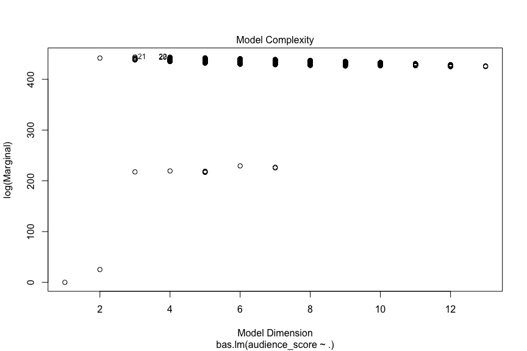

## Setup

### Load packages


```r
library(ggplot2)
library(dplyr)
library(statsr)
library(BAS)
```

### Load data


```r
load("movies.Rdata")
```


* * *

## Part 1: Data

In this study random sample were used and results can be generalized to the US population. Since no random assignment was used so causality can not be inferred. 

* * *

### Research Queastion

Can we predict audience score from variable that are mentioned in project direction?

## Part 2: Data manipulation

lets explore the data 


```r
summary(movies)
```

```
##     title                  title_type                 genre    
##  Length:651         Documentary : 55   Drama             :305  
##  Class :character   Feature Film:591   Comedy            : 87  
##  Mode  :character   TV Movie    :  5   Action & Adventure: 65  
##                                        Mystery & Suspense: 59  
##                                        Documentary       : 52  
##                                        Horror            : 23  
##                                        (Other)           : 60  
##     runtime       mpaa_rating                               studio   
##  Min.   : 39.0   G      : 19   Paramount Pictures              : 37  
##  1st Qu.: 92.0   NC-17  :  2   Warner Bros. Pictures           : 30  
##  Median :103.0   PG     :118   Sony Pictures Home Entertainment: 27  
##  Mean   :105.8   PG-13  :133   Universal Pictures              : 23  
##  3rd Qu.:115.8   R      :329   Warner Home Video               : 19  
##  Max.   :267.0   Unrated: 50   (Other)                         :507  
##  NA's   :1                     NA's                            :  8  
##  thtr_rel_year  thtr_rel_month   thtr_rel_day    dvd_rel_year 
##  Min.   :1970   Min.   : 1.00   Min.   : 1.00   Min.   :1991  
##  1st Qu.:1990   1st Qu.: 4.00   1st Qu.: 7.00   1st Qu.:2001  
##  Median :2000   Median : 7.00   Median :15.00   Median :2004  
##  Mean   :1998   Mean   : 6.74   Mean   :14.42   Mean   :2004  
##  3rd Qu.:2007   3rd Qu.:10.00   3rd Qu.:21.00   3rd Qu.:2008  
##  Max.   :2014   Max.   :12.00   Max.   :31.00   Max.   :2015  
##                                                 NA's   :8     
##  dvd_rel_month     dvd_rel_day     imdb_rating    imdb_num_votes  
##  Min.   : 1.000   Min.   : 1.00   Min.   :1.900   Min.   :   180  
##  1st Qu.: 3.000   1st Qu.: 7.00   1st Qu.:5.900   1st Qu.:  4546  
##  Median : 6.000   Median :15.00   Median :6.600   Median : 15116  
##  Mean   : 6.333   Mean   :15.01   Mean   :6.493   Mean   : 57533  
##  3rd Qu.: 9.000   3rd Qu.:23.00   3rd Qu.:7.300   3rd Qu.: 58300  
##  Max.   :12.000   Max.   :31.00   Max.   :9.000   Max.   :893008  
##  NA's   :8        NA's   :8                                       
##          critics_rating critics_score    audience_rating audience_score 
##  Certified Fresh:135    Min.   :  1.00   Spilled:275     Min.   :11.00  
##  Fresh          :209    1st Qu.: 33.00   Upright:376     1st Qu.:46.00  
##  Rotten         :307    Median : 61.00                   Median :65.00  
##                         Mean   : 57.69                   Mean   :62.36  
##                         3rd Qu.: 83.00                   3rd Qu.:80.00  
##                         Max.   :100.00                   Max.   :97.00  
##                                                                         
##  best_pic_nom best_pic_win best_actor_win best_actress_win best_dir_win
##  no :629      no :644      no :558        no :579          no :608     
##  yes: 22      yes:  7      yes: 93        yes: 72          yes: 43     
##                                                                        
##                                                                        
##                                                                        
##                                                                        
##                                                                        
##  top200_box   director            actor1             actor2         
##  no :636    Length:651         Length:651         Length:651        
##  yes: 15    Class :character   Class :character   Class :character  
##             Mode  :character   Mode  :character   Mode  :character  
##                                                                     
##                                                                     
##                                                                     
##                                                                     
##     actor3             actor4             actor5         
##  Length:651         Length:651         Length:651        
##  Class :character   Class :character   Class :character  
##  Mode  :character   Mode  :character   Mode  :character  
##                                                          
##                                                          
##                                                          
##                                                          
##    imdb_url            rt_url         
##  Length:651         Length:651        
##  Class :character   Class :character  
##  Mode  :character   Mode  :character  
##                                       
##                                       
##                                       
## 
```

Now create new variable: 


```r
movies <- movies %>% 
    mutate(feature_film = ifelse(title_type == 'Feature Film', 'yes', 'no'),
           drama =        ifelse(genre =='Drama', 'yes', 'no'),
           mpaa_rating_R =  ifelse(mpaa_rating == 'R', 'yes', 'no'),
           oscar_season = ifelse(thtr_rel_month %in% c(10:12), 'yes', 'no'),
           summer_season = ifelse(thtr_rel_month %in% c(5:8), 'yes','no'))
```

explore the dataset again.


```r
glimpse(movies)
```

```
## Observations: 651
## Variables: 37
## $ title            <chr> "Filly Brown", "The Dish", "Waiting for Guffm...
## $ title_type       <fct> Feature Film, Feature Film, Feature Film, Fea...
## $ genre            <fct> Drama, Drama, Comedy, Drama, Horror, Document...
## $ runtime          <dbl> 80, 101, 84, 139, 90, 78, 142, 93, 88, 119, 1...
## $ mpaa_rating      <fct> R, PG-13, R, PG, R, Unrated, PG-13, R, Unrate...
## $ studio           <fct> Indomina Media Inc., Warner Bros. Pictures, S...
## $ thtr_rel_year    <dbl> 2013, 2001, 1996, 1993, 2004, 2009, 1986, 199...
## $ thtr_rel_month   <dbl> 4, 3, 8, 10, 9, 1, 1, 11, 9, 3, 6, 12, 1, 9, ...
## $ thtr_rel_day     <dbl> 19, 14, 21, 1, 10, 15, 1, 8, 7, 2, 19, 18, 4,...
## $ dvd_rel_year     <dbl> 2013, 2001, 2001, 2001, 2005, 2010, 2003, 200...
## $ dvd_rel_month    <dbl> 7, 8, 8, 11, 4, 4, 2, 3, 1, 8, 5, 9, 7, 2, 3,...
## $ dvd_rel_day      <dbl> 30, 28, 21, 6, 19, 20, 18, 2, 21, 14, 1, 23, ...
## $ imdb_rating      <dbl> 5.5, 7.3, 7.6, 7.2, 5.1, 7.8, 7.2, 5.5, 7.5, ...
## $ imdb_num_votes   <int> 899, 12285, 22381, 35096, 2386, 333, 5016, 22...
## $ critics_rating   <fct> Rotten, Certified Fresh, Certified Fresh, Cer...
## $ critics_score    <dbl> 45, 96, 91, 80, 33, 91, 57, 17, 90, 83, 89, 6...
## $ audience_rating  <fct> Upright, Upright, Upright, Upright, Spilled, ...
## $ audience_score   <dbl> 73, 81, 91, 76, 27, 86, 76, 47, 89, 66, 75, 4...
## $ best_pic_nom     <fct> no, no, no, no, no, no, no, no, no, no, no, n...
## $ best_pic_win     <fct> no, no, no, no, no, no, no, no, no, no, no, n...
## $ best_actor_win   <fct> no, no, no, yes, no, no, no, yes, no, no, yes...
## $ best_actress_win <fct> no, no, no, no, no, no, no, no, no, no, no, n...
## $ best_dir_win     <fct> no, no, no, yes, no, no, no, no, no, no, no, ...
## $ top200_box       <fct> no, no, no, no, no, no, no, no, no, no, yes, ...
## $ director         <chr> "Michael D. Olmos", "Rob Sitch", "Christopher...
## $ actor1           <chr> "Gina Rodriguez", "Sam Neill", "Christopher G...
## $ actor2           <chr> "Jenni Rivera", "Kevin Harrington", "Catherin...
## $ actor3           <chr> "Lou Diamond Phillips", "Patrick Warburton", ...
## $ actor4           <chr> "Emilio Rivera", "Tom Long", "Eugene Levy", "...
## $ actor5           <chr> "Joseph Julian Soria", "Genevieve Mooy", "Bob...
## $ imdb_url         <chr> "http://www.imdb.com/title/tt1869425/", "http...
## $ rt_url           <chr> "//www.rottentomatoes.com/m/filly_brown_2012/...
## $ feature_film     <chr> "yes", "yes", "yes", "yes", "yes", "no", "yes...
## $ drama            <chr> "yes", "yes", "no", "yes", "no", "no", "yes",...
## $ mpaa_rating_R    <chr> "yes", "no", "yes", "no", "yes", "no", "no", ...
## $ oscar_season     <chr> "no", "no", "no", "yes", "no", "no", "no", "y...
## $ summer_season    <chr> "no", "no", "yes", "no", "no", "no", "no", "n...
```

Now convert the newly created variable to factor type from character type.


```r
movies[c('feature_film',
         'drama', 'mpaa_rating_R', 
         'oscar_season',
         'summer_season')] <- lapply(movies[c('feature_film', 
                                                'drama', 'mpaa_rating_R', 
                                                'oscar_season', 
                                              'summer_season')], factor)
```


```r
glimpse(movies)
```

```
## Observations: 651
## Variables: 37
## $ title            <chr> "Filly Brown", "The Dish", "Waiting for Guffm...
## $ title_type       <fct> Feature Film, Feature Film, Feature Film, Fea...
## $ genre            <fct> Drama, Drama, Comedy, Drama, Horror, Document...
## $ runtime          <dbl> 80, 101, 84, 139, 90, 78, 142, 93, 88, 119, 1...
## $ mpaa_rating      <fct> R, PG-13, R, PG, R, Unrated, PG-13, R, Unrate...
## $ studio           <fct> Indomina Media Inc., Warner Bros. Pictures, S...
## $ thtr_rel_year    <dbl> 2013, 2001, 1996, 1993, 2004, 2009, 1986, 199...
## $ thtr_rel_month   <dbl> 4, 3, 8, 10, 9, 1, 1, 11, 9, 3, 6, 12, 1, 9, ...
## $ thtr_rel_day     <dbl> 19, 14, 21, 1, 10, 15, 1, 8, 7, 2, 19, 18, 4,...
## $ dvd_rel_year     <dbl> 2013, 2001, 2001, 2001, 2005, 2010, 2003, 200...
## $ dvd_rel_month    <dbl> 7, 8, 8, 11, 4, 4, 2, 3, 1, 8, 5, 9, 7, 2, 3,...
## $ dvd_rel_day      <dbl> 30, 28, 21, 6, 19, 20, 18, 2, 21, 14, 1, 23, ...
## $ imdb_rating      <dbl> 5.5, 7.3, 7.6, 7.2, 5.1, 7.8, 7.2, 5.5, 7.5, ...
## $ imdb_num_votes   <int> 899, 12285, 22381, 35096, 2386, 333, 5016, 22...
## $ critics_rating   <fct> Rotten, Certified Fresh, Certified Fresh, Cer...
## $ critics_score    <dbl> 45, 96, 91, 80, 33, 91, 57, 17, 90, 83, 89, 6...
## $ audience_rating  <fct> Upright, Upright, Upright, Upright, Spilled, ...
## $ audience_score   <dbl> 73, 81, 91, 76, 27, 86, 76, 47, 89, 66, 75, 4...
## $ best_pic_nom     <fct> no, no, no, no, no, no, no, no, no, no, no, n...
## $ best_pic_win     <fct> no, no, no, no, no, no, no, no, no, no, no, n...
## $ best_actor_win   <fct> no, no, no, yes, no, no, no, yes, no, no, yes...
## $ best_actress_win <fct> no, no, no, no, no, no, no, no, no, no, no, n...
## $ best_dir_win     <fct> no, no, no, yes, no, no, no, no, no, no, no, ...
## $ top200_box       <fct> no, no, no, no, no, no, no, no, no, no, yes, ...
## $ director         <chr> "Michael D. Olmos", "Rob Sitch", "Christopher...
## $ actor1           <chr> "Gina Rodriguez", "Sam Neill", "Christopher G...
## $ actor2           <chr> "Jenni Rivera", "Kevin Harrington", "Catherin...
## $ actor3           <chr> "Lou Diamond Phillips", "Patrick Warburton", ...
## $ actor4           <chr> "Emilio Rivera", "Tom Long", "Eugene Levy", "...
## $ actor5           <chr> "Joseph Julian Soria", "Genevieve Mooy", "Bob...
## $ imdb_url         <chr> "http://www.imdb.com/title/tt1869425/", "http...
## $ rt_url           <chr> "//www.rottentomatoes.com/m/filly_brown_2012/...
## $ feature_film     <fct> yes, yes, yes, yes, yes, no, yes, yes, no, ye...
## $ drama            <fct> yes, yes, no, yes, no, no, yes, yes, no, yes,...
## $ mpaa_rating_R    <fct> yes, no, yes, no, yes, no, no, yes, no, no, n...
## $ oscar_season     <fct> no, no, no, yes, no, no, no, yes, no, no, no,...
## $ summer_season    <fct> no, no, yes, no, no, no, no, no, no, no, yes,...
```


Remove the NA value from runtime since we are going to use this as predictor later on.


```r
movies <- filter(movies, !is.na(runtime))
```


* * *

## Part 3: Exploratory Data Analysis

### Drama


```r
    ggplot(data = movies, mapping = aes(x = drama ,
                                        y = audience_score, 
                                        fill = drama))+
    geom_boxplot(outlier.colour = 'red',
                 outlier.shape = 1,
                 notch = F,
                 width = 0.5)+
    xlab('Drama')+
    ylab('Audience Score')+
    ggtitle('Difference in Audience Score in Drama' )+
    theme(panel.background = element_rect(fill = 'light blue'))+
    theme(plot.title = element_text(hjust = 0.5))
```

<!-- -->

Mean audience score is higher for drama movies.


```r
select(movies, audience_score, drama) %>% 
    group_by(drama) %>% 
    summarise(audience_score_mean = mean(audience_score),
              min = min(audience_score),
              max = max(audience_score))
```

<div class="kable-table">

drama    audience_score_mean   min   max
------  --------------------  ----  ----
no                  59.69565    11    97
yes                 65.34754    13    95

</div>

Mean audience score is 65.3 for drama category which is higher than movie that is not drama.


### Feature Films


```r
select(movies, audience_score, feature_film) %>% 
    group_by(feature_film) %>% 
    summarise(audience_score_mean = mean(audience_score),
              min = min(audience_score),
              max = max(audience_score))
```

<div class="kable-table">

feature_film    audience_score_mean   min   max
-------------  --------------------  ----  ----
no                         81.20339    19    96
yes                        60.46531    11    97

</div>

Feature Film has lower mean audience score which is 60.5.


```r
    ggplot(data = movies, mapping = aes(x = feature_film ,
                                        y = audience_score, 
                                        fill = feature_film))+
    geom_boxplot(outlier.colour = 'red',
                 outlier.shape = 1,
                 notch = F,
                 width = 0.5)+
    xlab('Feature Film')+
    ylab('Audience Score')+
    ggtitle('Difference in Audience Score in Feature Film' )+
    theme(panel.background = element_rect(fill = 'light blue'))+
    theme(plot.title = element_text(hjust = 0.5))
```

<!-- -->

Film that is not featured has higher mean audience score.

### mpaa_rating_R


```r
select(movies, audience_score, mpaa_rating_R) %>% 
    group_by(mpaa_rating_R )%>% 
    summarise(audience_score_mean = mean(audience_score),
              min = min(audience_score),
              max = max(audience_score))
```

<div class="kable-table">

mpaa_rating_R    audience_score_mean   min   max
--------------  --------------------  ----  ----
no                          62.66044    11    96
yes                         62.04255    14    97

</div>

very little difference in mean audince score whether mpaa rating is R or not.


```r
 ggplot(data = movies, mapping = aes(x = mpaa_rating_R , 
                                     y = audience_score,
                                     fill = mpaa_rating_R))+
    geom_boxplot(outlier.colour = 'red',
                 outlier.shape = 1,
                 notch = F,
                 width = 0.5)+
    xlab('mpaa_rating_R')+
    ylab('Audience Score')+
    ggtitle('Difference in Audience Score in mpaa_rating_R' )+
    theme(panel.background = element_rect(fill = 'light blue'))+
    theme(plot.title = element_text(hjust = 0.5))
```

<!-- -->

We can also visualize the small differnce.

### Oscar Season


```r
select(movies, audience_score, oscar_season) %>% 
    group_by(oscar_season )%>% 
    summarise(audience_score_mean = mean(audience_score),
              min = min(audience_score),
              max = max(audience_score))
```

<div class="kable-table">

oscar_season    audience_score_mean   min   max
-------------  --------------------  ----  ----
no                         61.81304    11    96
yes                        63.64211    13    97

</div>


mean audince score is 63.6 when movie release in oscar season which is higher.


```r
 ggplot(data = movies, mapping = aes(x = oscar_season , 
                                     y = audience_score, 
                                     fill = oscar_season))+
    geom_boxplot(outlier.colour = 'red',
                 outlier.shape = 1,
                 notch = F,
                 width = 0.5)+
    xlab('Oscar Season')+
    ylab('Audience Score')+
    ggtitle('Difference in Audience Score in Oscar Season' )+
    theme(panel.background = element_rect(fill = 'light blue'))+
    theme(plot.title = element_text(hjust = 0.5))
```

<!-- -->

difference can be visualize and we can see that difference is small.


### Summaer Season


```r
select(movies, audience_score, summer_season) %>% 
    group_by(summer_season )%>% 
    summarise(audience_score_mean = mean(audience_score),
              min = min(audience_score),
              max = max(audience_score))
```

<div class="kable-table">

summer_season    audience_score_mean   min   max
--------------  --------------------  ----  ----
no                          62.60181    13    97
yes                         61.80769    11    94

</div>

Mean audience score for summer season 61.8 which is lower than not release in summer season.


```r
 ggplot(data = movies, mapping = aes(x = summer_season,
                                     y = audience_score, 
                                     fill=summer_season))+
    geom_boxplot(outlier.colour = 'red',
                 outlier.shape = 1,
                 notch = F,
                 width = 0.5)+
    xlab('Summer Season')+
    ylab('Audience Score')+
    ggtitle('Difference in Audience Score in Summer Season' )+
    theme(panel.background = element_rect(fill = 'light blue'))+
    theme(plot.title = element_text(hjust = 0.5))
```

<!-- -->

from the above plot we can see that movie that is released in summer season has lower mean audience score.


* * *

## Part 4: Modeling

create a dataframe with required variaables.


```r
movies <- select( movies,
                  audience_score,
                 feature_film, 
                 drama,
                 runtime,
                 mpaa_rating_R,
                 thtr_rel_year,
                 oscar_season,
                 summer_season,
                 imdb_rating,
                 imdb_num_votes,
                 critics_score,
                 best_pic_nom,
                 best_pic_win,
                 best_actor_win,
                 best_actress_win,
                 best_dir_win,
                 top200_box)
```


explore the dataset.


```r
summary(movies)
```

```
##  audience_score  feature_film drama        runtime      mpaa_rating_R
##  Min.   :11.00   no : 59      no :345   Min.   : 39.0   no :321      
##  1st Qu.:46.00   yes:591      yes:305   1st Qu.: 92.0   yes:329      
##  Median :65.00                          Median :103.0                
##  Mean   :62.35                          Mean   :105.8                
##  3rd Qu.:80.00                          3rd Qu.:115.8                
##  Max.   :97.00                          Max.   :267.0                
##  thtr_rel_year  oscar_season summer_season  imdb_rating   
##  Min.   :1970   no :460      no :442       Min.   :1.900  
##  1st Qu.:1990   yes:190      yes:208       1st Qu.:5.900  
##  Median :2000                              Median :6.600  
##  Mean   :1998                              Mean   :6.492  
##  3rd Qu.:2007                              3rd Qu.:7.300  
##  Max.   :2014                              Max.   :9.000  
##  imdb_num_votes   critics_score    best_pic_nom best_pic_win
##  Min.   :   180   Min.   :  1.00   no :628      no :643     
##  1st Qu.:  4584   1st Qu.: 33.00   yes: 22      yes:  7     
##  Median : 15204   Median : 61.00                            
##  Mean   : 57620   Mean   : 57.65                            
##  3rd Qu.: 58484   3rd Qu.: 83.00                            
##  Max.   :893008   Max.   :100.00                            
##  best_actor_win best_actress_win best_dir_win top200_box
##  no :557        no :578          no :607      no :635   
##  yes: 93        yes: 72          yes: 43      yes: 15   
##                                                         
##                                                         
##                                                         
## 
```

### Model


```r
model_bayes2 <- bas.lm(audience_score ~ ., 
                       data=movies,
                       method='MCMC', 
                       prior='ZS-null',
                       modelprior=uniform())
```


### Diagnostics


```r
plot(model_bayes2)
```

<!-- --><!-- --><!-- --><!-- -->


```r
image(model_bayes2, rotate = F)
```

<!-- -->


```r
diagnostics(model_bayes2, type = 'model')
```

<!-- -->


```r
round(summary(model_bayes2),3)
```

```
##                     P(B != 0 | Y) model 1 model 2 model 3 model 4 model 5
## Intercept                   1.000   1.000   1.000   1.000   1.000   1.000
## feature_filmyes             0.068   0.000   0.000   0.000   0.000   0.000
## dramayes                    0.046   0.000   0.000   0.000   0.000   0.000
## runtime                     0.466   0.000   1.000   0.000   0.000   1.000
## mpaa_rating_Ryes            0.202   0.000   0.000   1.000   0.000   1.000
## thtr_rel_year               0.094   0.000   0.000   0.000   0.000   0.000
## oscar_seasonyes             0.078   0.000   0.000   0.000   0.000   0.000
## summer_seasonyes            0.085   0.000   0.000   0.000   0.000   0.000
## imdb_rating                 1.000   1.000   1.000   1.000   1.000   1.000
## imdb_num_votes              0.061   0.000   0.000   0.000   0.000   0.000
## critics_score               0.883   1.000   1.000   1.000   1.000   1.000
## best_pic_nomyes             0.137   0.000   0.000   0.000   0.000   0.000
## best_pic_winyes             0.043   0.000   0.000   0.000   0.000   0.000
## best_actor_winyes           0.145   0.000   0.000   0.000   1.000   0.000
## best_actress_winyes         0.144   0.000   0.000   0.000   0.000   0.000
## best_dir_winyes             0.069   0.000   0.000   0.000   0.000   0.000
## top200_boxyes               0.049   0.000   0.000   0.000   0.000   0.000
## BF                             NA   1.000   0.870   0.222   0.224   0.206
## PostProbs                      NA   0.139   0.122   0.030   0.030   0.028
## R2                             NA   0.752   0.755   0.754   0.754   0.756
## dim                            NA   3.000   4.000   4.000   4.000   5.000
## logmarg                        NA 443.950 443.811 442.443 442.452 442.368
```


### Coefficients

We can plot the the important predictor ibdb raing and critics score from above image.


```r
par(mfrow = c(1,3))
plot(coefficients(model_bayes2), subset = c(1,9,11), ask = FALSE)
```

<!-- -->


* * *

## Part 5: Prediction


```r
beast_find <- data.frame(audience_score=79,
                         feature_film=factor("yes", levels=c("yes", "no")),
                         drama=factor("no", levels=c("yes", "no")),
                         runtime=132,
                         mpaa_rating_R=factor("no", levels=c("yes", "no")),
                         thtr_rel_year=2016,
                         oscar_season=factor("yes", levels=c("yes", "no")),
                         summer_season=factor("no", levels=c("yes", "no")),
                         imdb_rating=7.4,
                         imdb_num_votes=320961,
                         critics_score=74,
                         best_pic_nom=factor("no", levels=c("yes", "no")),
                         best_pic_win=factor("no", levels=c("yes", "no")),
                         best_actor_win=factor("no", levels=c("yes", "no")),
                         best_actress_win=factor("no", levels=c("yes", "no")),
                         best_dir_win=factor("no", levels=c("yes", "no")),
                         top200_box=factor("no", levels=c("yes", "no")))
```


```r
score_predic<- predict(model_bayes2, 
                       newdata=beast_find, 
                       estimator="BMA", 
                       se.fit=TRUE)
```


```r
#margin

margin <- qt(0.95, df=score_predic$se.bma.pred[1]) *
                     mean(score_predic$se.bma.pred)
```


```r
beast_predic_interval <- data.frame(
    'title'      ="Fantastic Beast and where to find them",
    'prediction' =sprintf("%2.1f", score_predic$Ybma),
    'interval'   =sprintf("%2.1f - %2.1f", score_predic$Ybma - margin,
                          score_predic$Ybma + margin),
    
    'actual'     =79)

beast_predic_interval
```

<div class="kable-table">

title                                    prediction   interval       actual
---------------------------------------  -----------  ------------  -------
Fantastic Beast and where to find them   76.4         58.1 - 94.7        79

</div>


### Reference(s) 

**Movie** - **FANTASTIC BEASTS AND WHERE TO FIND THEM (2016)**   
**data source link** -
[imdb](https://www.imdb.com/title/tt3183660/?ref_=nv_sr_2) and   [rottentomatoes](https://www.rottentomatoes.com/m/fantastic_beasts_and_where_to_find_them)

* * *

## Part 6: Conclusion

Important predictor are imdb rating and critics score. 
