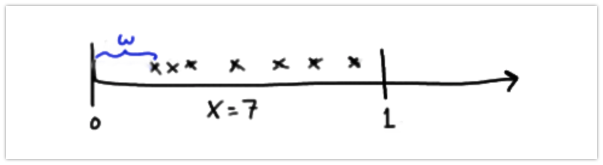

### trial
bernoulli (discrete)  
binomial (discrete)  
geometric (discrete)  
negative bionomial (discrete)  
hypergeometric (discrete)  

beta (continous)  

### time/ rate
poisson (discrete)  

exponential (negative exponential) (continous)  
Gamma (continous)  


### Binomial Distribution
##### Bernoulli Distribution


Bernoulli Distribution is special case of binomial distribution, 
where n=1.  
(n = number of trial)

$$PMF  :   {{1}\choose{k}} \cdot p^k(1-p)^{1-k}$$
$$PMF  :p^k(1-p)^{1-k}$$

#### bionomial distribution

n trial,   
k successes, __(with replacement) __ 
fixed probability  

$$PMF  :   {{n}\choose{k}} \cdot p^k(1-p)^{n-k}$$
$$mean= np $$ 
$$variance= np(1-p)$$


__Question__: A coin tossed 8 times. Probability for getting head is 0.25, what is the probability that you will get exactly 5 head?

n = 8 
k = 5    
p = 0.25  

```{r}
dbinom(5, size = 8, prob = .25)
```
 
 
 plot the distribution
 
```{r}

y <- dbinom(0:8, 8, .25)
round(y, digits = 3)

barplot(y, col = 'skyblue', names.arg = c(0:8))
```
 
__Question:__ Probability of getting at most 3 head? (not more than 3 head)

```{r}
sum(dbinom(0:3, 8, 0.25)) # sum the probability for 0,1,2,3.

# or

pbinom(3, 8, 0.25, lower.tail = TRUE)
```

 
 __Question:__ Rolling a die for 15 times. what is the probability that you will get 3 exactly 8 times?  
 probability of getting 3 is: p = 1/6  
 n = 15  
 k = 8  
 
```{r}
dbinom(8, 15, 1/6)
```
 #### plot the distribution  
 
```{r}
y <- dbinom(0:15, 15, 1/6)
round(y, digits = 3)

barplot(y, col = 'skyblue', names.arg = c(0:15))
```


### Geometric Distribution

__Definition:__ Assume Bernoulli trials — that is,  
(1) there are two possible outcomes,  
(2) the trials are independent,  
(3) p, the probability of success, remains the same from trial to trial.   
Let k denote the number of trials until the first success.

(k = number of fail before success)

$$ PMF: (1-p)^{k-1}\cdot{p}$$
$$ mean = \frac{1}{p}$$ 

$$ variance =\frac {(1-p)}{p^2}$$

__Question:__ Products produced by a machine has a 3% defective rate.  
What is the probability that the first defective occurs in the fifth item inspected?

The convention in R is to record k as the number of failures that occur before the first success.

success at fifth item so k= 4, 
prob = 0.03

```{r}
dgeom(4, 0.03)
```

__Question:__ What is the probability that the first defective occurs in the first five inspections?

```{r}
pgeom(4, 0.03)
```

__Question:__ a production line which has a 20% defective rate,  
what is the minimum number of inspections, that would be necessary so that the probability of observing a defective is more that 75%?

Choose k so that 
P(X ≤ k) ≥ .75

```{r}
qgeom(0.75, 0.2)
```

6 failures before first success.
or with 7 inspections, there is at least a 75% chance of obtaining the first defective.


__Question:__ A representative from the National Football League's Marketing Division randomly selects people on a random street in Kansas City, Kansas until he finds a person who attended the last home football game. Let p, the probability that he succeeds in finding such a person, equal 0.20. And, let k denote the number of people he selects until he finds his first success. What is the probability that the marketing representative must select 4 people before he finds one who attended the last home football game

fourth person attended the game, so k = 3,   
p = 0.20


```{r}
dgeom(3, 0.2)
```
There is about a 10% chance that the marketing representative would have to select 4 people before he would find one who attended the last home football game.


What is the probability that the marketing representative must select more than 6 people before he finds one who attended the last home football game?
 

```{r}
1-pgeom(5, 0.2)
```
There is about a 26% chance that the marketing representative would have to select more than 6 people before he would find one who attended the last home football game.


```{r}
y <- dgeom(0:10, prob = 0.2)
round(y, digits = 3)

barplot(y, col = 'skyblue', names.arg = c(0:10))
```
```{r}
y <- dgeom(0:10, prob = 0.5)
round(y, digits = 3)
x <- c(0:10)
plot(x,y, type = "h", col='blue')
```


### Hypergeometric Distribution

the hypergeometric distribution is a discrete probability distribution that describes the probability of k successes (random draws for which the object drawn has a specified feature) in  n draws, __without replacement__,  from a finite population of size N that contains exactly K objects with that feature, wherein each draw is either a success or a failure.
In contrast, the binomial distribution describes the probability of k successes in  n draws with replacement.

$$PMF  : \frac{  {{K}\choose{k}}{{N-K}\choose{n-k}}}{{N}\choose{n}} $$
$$ mean = n \frac{K}{N}$$

 N = Population   
 n =  sample or number of draw  
 K =  Number of success in population N  
 k = number of success came in the draw    
 N-K = failure  
 
__Question:__ There are 52 cards in the deck. Find the probability of getting 1 red card out of two cards chosen randomly without replacement.

total population, N = 52  
sample population, n = 2  
number of success in total population, K = 26  
number of success in draws, k = 1

the probability of getting one success will be,  
$$ \frac{  {{K}\choose{k}}{{N-K}\choose{n-k}}}{{N}\choose{n}}$$
$$  = \frac{  {{26}\choose{1}}{{52-26}\choose{2-1}}}{{52}\choose{2}}=0.5098039$$


```{r}
dhyper(1,26,26,2)
```

__Question:__ Draw 6 cards from a deck without replacement.  
What is the probability of getting two hearts?

N = 52, total cards  
K = 13, number of hearts  
n = 6, draw  
k = 2, number of success in draws  


$$ \frac{  {{13}\choose{2}}{{52-13}\choose{6-2}}}{{52}\choose{6}}= 0.3151299$$


```{r}
# dhyper(k,K,(N-K), n)

dhyper(2,13,(52-13),6) # both same 
dhyper(2,13,39,6)

```

__Question:__ probability of getting at most 2 hearts in the
6 selected without replacement from a well shuffled deck?


```{r}
phyper(2,13,39,6) # Cumulative Distribution function
```


plot distribution

```{r}
x <- 0:6
plot(x, dhyper(x,13,39,6), type = "h", col="red", ylab = 'pbobability', main = 'Hypergeometric Distribution')
```


### Negative binomial Distribution


Definition: Assume Bernoulli trials — that is,  
(1) there are two possible outcomes,  
(2) the trials are independent, and  
(3) p, the probability of success, remains the same from trial to trial. Let n denote the number of trials until the $k^{th}$ success. Then, the probability mass function:

[details in this link](https://onlinecourses.science.psu.edu/stat414/node/78/)
changed to following from thewebsite  
x=n  
r=k  

$$   {{n-1}\choose{k-1}} \cdot(1-p)^{(n-k)}\cdot p^k$$
$\color{red}{\text {A geometric distribution is a special case of a negative binomial distribution with k = 1.}}$

$$mean = \frac{k}{p}$$
$$variance = \frac{k(1-p)}{p^2}$$
__question:__ An oil company conducts a geological study that indicates that an exploratory oil well should have a 20% chance of striking oil. What is the probability that the first strike comes on the third well drilled?

k = 1  
n = 3  
p = 0.20  
1-p = 0.80  

$$   {{3-1}\choose{1-1}} \cdot(1-p)^{(3-1)}\cdot p^1 = (0.8)^2\times 0.20= 0.128$$


__Q__ What is the probability that the third strike comes on the seventh well drilled?

k = 3  
n = 7  
p = 0.20  
1-p = 0.80 

$$   {{7-1}\choose{3-1}} \cdot(1-p)^{(7-3)}\cdot p^3 = {{6}\choose{2}}(0.8)^4\times 0.20^3= 0.049$$
in R dnbinom function is used.


### Poisson Distribution  

[link](http://www.r-tutor.com/elementary-statistics/probability-distributions/poisson-distribution)

The Poisson distribution is the probability distribution of independent event occurrences in an interval. If λ is the mean occurrence per interval, then the probability of having k occurrences within a given interval is:  


$$= \frac{e^{-\lambda} \lambda^k}{k!}$$ 
where λ = rate  
k = occurance  
__e__ = 2.71828  

$$ mean = \lambda$$
$$ Variance = \lambda$$


__Question__ If there are 12 cars crossing a bridge per minute on average, find the probability of having 17 car crossing the bridge in a particular minute.
Here,  

λ = 12   
k = 17 

$$= \frac{2.718^{-12} \times12^{17}}{17!}= 0.0383$$ 
```{r}
dpois(17, 12)
```


__Question__ If there are 12 cars crossing a bridge per minute on average, find the probability of having 17 or more cars crossing the bridge in a particular minute.
λ = 12   
k = 16 # since we need 17 or more, so upto 16 has been substracted.


```{r}
1-ppois(16,12) # or 

ppois(16, 12, lower.tail = FALSE)
```


now plot  

```{r}
x <- 0:30
plot(x, dpois(x, 12), type = "h", col="blue", ylab = 'pbobability', main = 'Poisson Distribution')
```


```{r echo=TRUE, message=FALSE, warning=FALSE}
library(tidyverse)
x <- 0:30
y <- dpois(x,12)
z <- cbind(x,y)
z <- data.frame(z)
z$x <- as.factor(z$x)

ggplot(data = z, aes(y=y, x=x))+
    geom_bar(stat = 'identity', fill= "skyblue")
  
```


__Question__ number of typos on a printed page with a mean of 3 typos per page. What is the probability that a randomly selected page has at most one typo on it?
[link](https://onlinecourses.science.psu.edu/stat414/node/82/)


```{r}
ppois(1,3) # 

sum(dpois(0:1, 3))
```

Now plot


### Normal Distribution


### Exponential Distribution

the exponential distribution (also known as negative exponential distribution) is the probability distribution that describes the time between events in a Poisson point process, i.e., a process in which events occur continuously and independently at a constant average rate. It is a particular case of the gamma distribution. It is the continuous analogue of the geometric distribution, and it has the key property of being memoryless. In addition to being used for the analysis of Poisson point processes it is found in various other contexts. (wiki)

$$={e^{-\lambda{k}} \cdot \lambda}$$ 

$$mean =\frac{1}{ \lambda}=(\beta)=(\theta)$$ 

$$variance =\frac{1}{ \lambda^2}= (\beta^2)$$ 


Suppose X, following an (approximate) Poisson process, equals the number of customers arriving at a bank in an interval of length 1. If λ, the mean number of customers arriving in an interval of length 1, is 6, say, then we might observe something like this:

  

[details](https://onlinecourses.science.psu.edu/stat414/node/138/)

In this particular representation, seven (7) customers arrived in the unit interval. Previously, our focus would have been on the discrete random variable X, the number of customers arriving. As the picture suggests, however, we could alternatively be interested in the continuous random variable W, the waiting time until the first customer arrives. Let's push this a bit further to see if we can find F(w), the cumulative distribution function of W:

If λ (the Greek letter "lambda") equals the mean number of events in an interval, and θ (the Greek letter "theta") equals the mean waiting time until the first customer arrives, then:

$$\theta= \frac{1}{\lambda}$$ and $$\lambda= \frac{1}{\theta}$$

For example, suppose the mean number of customers to arrive at a bank in a 1-hour interval is 10. Then, the average (waiting) time until the first customer is 1/10 of an hour, or 6 minutes. 

Let's now formally define the probability density function we have just derived.


$$ = \frac{1}{\theta}\cdot{e^{-x/\theta}} = \lambda\cdot{e^{-x\lambda}}$$


__question__ Students arrive at a local bar and restaurant according to an approximate Poisson process at a mean rate of 30 students per hour. What is the probability that the bouncer has to wait more than 3 minutes to card the next student?

__question__  The number of miles that a particular car can run before its battery wears out is exponentially distributed with an average of 10,000 miles. The owner of the car needs to take a 5000-mile trip. What is the probability that he will be able to complete the trip without having to replace the car battery?


[link](http://www.r-tutor.com/elementary-statistics/probability-distributions/exponential-distribution)

he exponential distribution describes the arrival time of a randomly recurring independent event sequence. If μ is the mean waiting time for the next event recurrence, its probability density function is:
$$ = \frac{1}{\mu}\cdot{e^{-x/\mu}}$$ when x=> 0.


__question__ Suppose the mean checkout time of a supermarket cashier is three minutes. Find the probability of a customer checkout being completed by the cashier in less than two minutes.
__solution__ 
The checkout processing rate is equals to one divided by the mean checkout completion time. Hence the processing rate is 1/3 checkouts per minute. We then apply the function pexp of the exponential distribution with rate=1/3.

```{r}
pexp(2,rate = 1/3)
```

The probability of finishing a checkout in under two minutes by the cashier is 48.7%


### Beta Distribution


Definition 1: For the binomial distribution the number of successes x is the random variable and the number of trials n and the probability of success p on any single trial are parameters (i.e. constants).  
Instead we would like to view the probability of success on any single trial as the random variable, and the number of trials n and the total number of successes in n trials as constants.  
[link](http://www.real-statistics.com/binomial-and-related-distributions/beta-distribution/)

Let,  
α = # of successes in n trials and  
β = # of failures in n trials (and so α + β = n).   
The probability density function (pdf) for x = the probability of success on any single trial is given by


$$ = x^{\alpha-{1}}\cdot(1-x)^{{\beta}-{1}}\cdot \frac{(n-1)!}{(\alpha-1)!\times(\beta-1)!}$$
This is a special case of the beta function  

$$ = x^{\alpha-{1}}\cdot(1-x)^{{\beta}-{1}}\cdot \frac{\Gamma(\alpha+\beta)}{\Gamma\alpha\cdot \Gamma\beta}$$
where $\Gamma$  is the gamma function and $\Gamma n= (n-1)!$


$$mean= \frac{\alpha}{\alpha+\beta}$$


__Question:__ A lottery organization claims that at least one out of every ten people wins. Of the last 500 lottery tickets sold 37 were winners. Based on this sample, what is the probability that the lottery organization’s claim is true: namely players have at least a 10% probability of buying a winning ticket? What is the 95% confidence interval?

$\alpha = 37$  
$\beta = 500-37 =463$  

```{r}
pbeta(.1, 37,463)
1- pbeta(.1, 37, 463)
```
Thus the probability that the organization’s claim is true is 100% – 98.1% = 1.9%


### Gamma Distribution

[link](http://www.real-statistics.com/other-key-distributions/gamma-distribution/)

The gamma distribution has the same relationship to the Poisson distribution that the negative binomial distribution has to the binomial distribution.  
We aren’t going to study the gamma distribution directly, but it is related to the exponential distribution and especially to the chi-square distribution


$$\frac{x^{\alpha-1}\cdot e^{-x/{\beta}}}{\beta^{\alpha}\cdot\Gamma(\alpha)}$$
__question:__  Suppose that sending a money order is a random event and that at a particular shop someone sends a money order on average every 15 minutes. What is the probability that the shop sends a total of 10 money orders in less than 3 hours?

 λ = 4  money order per hour.  
Let x = the time to send 10 money orders and  
let F(x) be the cumulative gamma distribution function with α = k = 10,    
β = 1/λ = 0.25


```{r}

```
 in excel, 
 P(x<3) = F(3) = GAMMADIST(3, 10, .25, TRUE) = .7586
 
 and so the probability is 75.86%.  
 
 see also this [link](https://onlinecourses.science.psu.edu/stat414/node/144/)

__question:__ Engineers designing the next generation of space shuttles plan to include two fuel pumps —one active, the other in reserve. If the primary pump malfunctions, the second is automatically brought on line. Suppose a typical mission is expected to require that fuel be pumped for at most 50 hours. According to the manufacturer's specifications, pumps are expected to fail once every 100 hours. What are the chances that such a fuel pump system would not remain functioning for the full 50 hours?

##### Why did we invent Gamma distribution?

##### Answer: To predict the wait time until future events.

Hmmm ok, but I thought that’s what the exponential distribution is for.    Then, what’s the difference between exponential distribution and gamma distribution?

The exponential distribution predicts the wait time until the *very first* event.   
The gamma distribution, on the other hand, predicts the wait time until the *k-th* event occurs.


### Cauchy Distribution


### chi-squared 


The chi-square distribution with k degrees of freedom, abbreviated $\chi^2(k)$, has probability density function

$$\frac{{x^{(k/2)-{1}}\cdot e^{-x/{2}}}}  {{2^{k/2}\cdot\Gamma(k/2)}}$$
The chi-square distribution is the gamma distribution where α = k/2 and β = 2.


As df grows larger the fat part of the curve shifts to the right and becomes more like the graph of a normal distribution.


Find the 95th percentile of the Chi-Squared distribution with 7 degrees of freedom.

We apply the quantile function qchisq of the Chi-Squared distribution against the decimal values 0.95.

```{r}
qchisq(.95, df = 7)
```
the 95th percentile of the Chi-Squared distribution with 7 degrees of freedom is 14.067.

### Erlang Distribution

### F distribution

### Student's t distribution

##### important link

[stat 414](https://onlinecourses.science.psu.edu/stat414/node/89/)  
[real-statistics](http://www.real-statistics.com/other-key-distributions/gamma-distribution/)  
[r-tutor](http://www.r-tutor.com/elementary-statistics/probability-distributions)  


A geometric distribution is a special case of a negative binomial distribution with k = 1.

the exponential distribution (also known as negative exponential distribution) is the probability distribution that describes the time between events in a Poisson point process

The gamma distribution has the same relationship to the Poisson distribution  
that the negative binomial distribution has to the binomial distribution.

The chi-square distribution is the gamma distribution where α = k/2 and β = 2.


